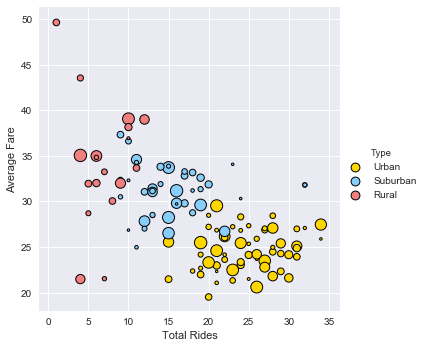
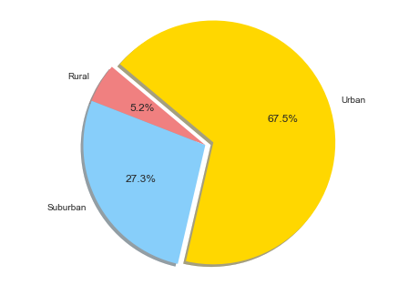
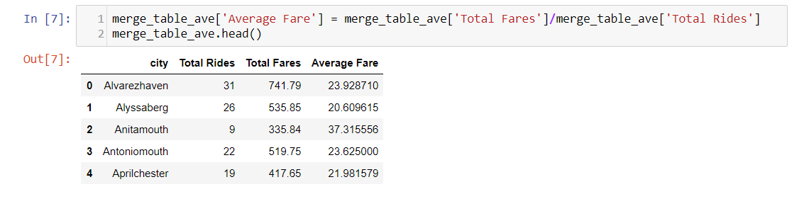

## Unit 5 | Python Ride Sharing Data Analysis

Skills tested: Matplotlib, Pandas, Merging Datasets, Bubble/Pie charts via Seaborn

Pyber is a theoretical ride sharing company with a recordset of rides.  Responsibilities of a Data Strategiest is to locate new opportunites for market differentiation.  With the recordset of rides, a visual representation is needed to support analysis of new opportunities for potential growth.  

Analysis #1: Looking at the bubble plot, you will notice that the average fare decreases in urban areas and gradually increases as you go to suburban and then to rural areas. One conclusion can be reached, is that urban areas exhibit a perfect competition, where the number of willing drivers drive down the price per ride. In which drivers compete with one another for fares, and hence drive down each others' average price per ride. To support the perfect competition theory, the pie charts show that there is a defecit of drivers to the number of rides within the suburban and rural areas. Whereas in the urban areas, there is a much greater number of drivers. We also see that the minimum average price that a driver is willing to accept is about 20 dollars, across all types. Which means that for Pyber to exist, it must pay drivers above this minimum amount in order to facilitate a transaction.

Analysis #2: Looking at the pie chart for total fares, rural and suburban areas represent a 6.6% and 31.4% of the total. Which is a potential growth opportunity in those segments. A couple reasons why we are seeing low total fares in those areas are; the average cost per ride is too high which make people opt to drive themselves and that more people own cars in those areas. So in order to get more people to ride-share, we would need to bring down the average cost per ride by increasing the number of drivers (to bring down the price and subsequently more ride-shares). Running promotions such as coupons for ride-sharers and offerring more incentives to drivers may increase ridership. In the short term, Pyber's bottom line may take a hit, but it can prove to be a good investment as people realize Pyber as a good substitute for owning a car.

Analysis #3: If you look at the bubble plot, you'll notice the size of the bubbles corresponds to the number of drivers, but as the price per ride goes up, one might think that there would be more drivers in that area, according to the supply curve theory (that as prices go up, supply goes up). So one might conclude that the small bubble at nearly 50 dollars would cause people living at that town would become drivers, but the fact is there was no increase in the number of drivers, which leads me to believe that most people in that area might have a higher oppurtunity cost, and hence will not drive. In other words, that area maybe have a higher income bracket.

